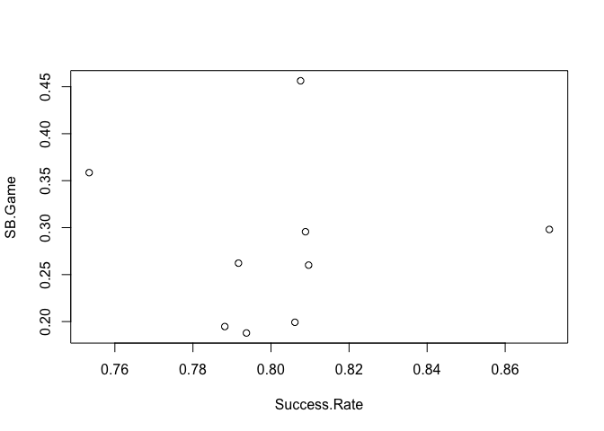

Ch02
================
Vincent Alegrete
2024-12-22

### Problem 1 (Top Base Stealers in the Hall of Fame)

The following table gives the number of stolen bases (SB), the number of
times caught stealing (CS), and the number of games played (G) for nine
players currently inducted in the Hall of Fame.

1)  In R, place the stolen base, caught stealing, and game counts in the
    vectors <tt>SB</tt>, <tt>CS</tt>, and <tt>G</tt>.

<i>Solution</i>

``` r
SB <- c(1406, 938, 897, 741, 738, 689, 506, 504, 474)
CS <- c(335, 307, 212, 195, 109, 162, 136, 131, 114)
G <- c(3081, 2616, 3034, 2826, 2476, 2649, 2599, 2683, 2379)
```

2)  For all players, compute the number of stolen base attempts <tt>SB +
    CS</tt> and store in the vector <tt>SB.Attempt</tt>.

<i>Solution</i>

``` r
SB.Attempt <- SB + CS
```

3)  For all players, compute the success rate <tt>Success.Rate =
    SB/SB.Attempt</tt>.

<i>Solution</i>

``` r
Success.Rate <- SB / SB.Attempt
```

4)  Compute the number of stolen bases per game <tt>SB.Game =
    SB/Game</tt>.

<i>Solution</i>

``` r
SB.Game <- SB / G
```

5)  Construct a scatterplot of the stolen bases per game against the
    success rates. Are there particular players with unusually high or
    low stolen base success rates? Which player had the greatest number
    of stolen bases per game?

<i>Solution</i> The plot does show some unusually high and low stolen
base success rates:

``` r
plot(SB.Game ~ Success.Rate)
```

<!-- -->

To get the requested players, we cross-reference a vector of player
names:

``` r
Names <- c("Rickey Henderson", "Lou Brock", "Ty Cobb", "Eddie Collins",
           "Max Carey", "Joe Morgan", "Luis Aparicio", "Paul Molitor",
           "Roberto Alomar")

Names[which.min(Success.Rate)]
```

    ## [1] "Lou Brock"

``` r
Names[which.max(Success.Rate)]
```

    ## [1] "Max Carey"

``` r
Names[which.max(SB.Game)]
```

    ## [1] "Rickey Henderson"

### Problem 2 (Character, Factor, and Logical Variables in R)

Suppose one records the outcomes of a batter in ten plate appearances:
Single, Out, Out, Single, Out, Double, Out, Walk, Out, Single.

1)  Use the <tt>c</tt> function to collect these outcomes in a character
    vector <tt>outcomes</tt>.

``` r
outcomes <- c("Single", "Out", "Out", "Single", "Out",
              "Double", "Out", "Walk", "Out", "Single")
```

2)  Use the table function to construct a frequency table of outcomes.

``` r
table(outcomes)
```

    ## outcomes
    ## Double    Out Single   Walk 
    ##      1      5      3      1

3)  In tabulating these last results, suppose one prefers the results to
    be ordered from least-successful to most-successful. Convert the
    character vector outcomes to a factor variable. Use the table
    function to tabulate the values in <tt>f.outcomes</tt>. How does the
    output differ from what you saw in part (b)?

<i>Solution</i> The table is now ordered according to our factor levels:

``` r
f.outcomes <- factor(outcomes,
                     levels=c("Out", "Walk", "Single", "Double"))
table(f.outcomes)
```

    ## f.outcomes
    ##    Out   Walk Single Double 
    ##      5      1      3      1

4)  Suppose you want to focus only on the walks in the plate
    appearances. Describe what is done in each of the following
    statements:

<tt>outcomes == “Walk”</tt>

<tt>sum(outcomes == “Walk”)</tt>

<i>Solution</i> The first line returns a boolean vector containing the
elementwise results of this test:

``` r
outcomes == "Walk"
```

    ##  [1] FALSE FALSE FALSE FALSE FALSE FALSE FALSE  TRUE FALSE FALSE

Summing the vector gives the number of walks (<tt>TRUE</tt> is treated
as a 1):

``` r
sum(outcomes == "Walk")
```

    ## [1] 1

# Problem 3 (Pitchers in the 350-Wins Club)
